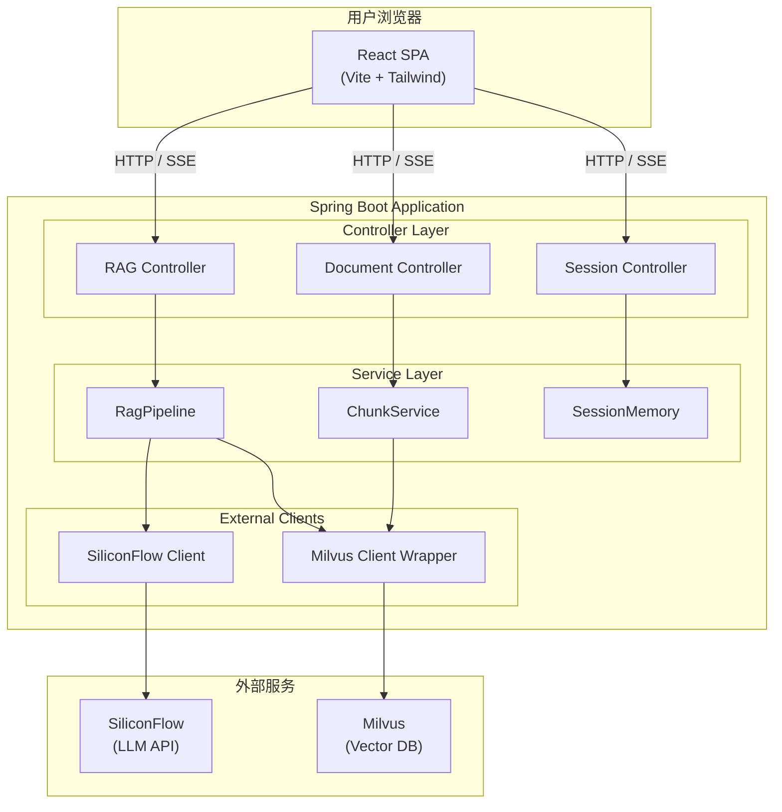

# 架构说明

## 系统架构

## RAG Pipeline 流程

### 知识检索路径

1. **会话记忆加载** — 从 SQLite 加载对话历史，滑动窗口保留最近 N 轮
2. **意图分类** — 规则匹配 + LLM 分类，路由到对应处理路径
3. **问题重写** — 结合对话历史做指代消解、上下文补全
4. **向量化** — 调用 SiliconFlow Embedding API 生成查询向量
5. **混合检索** — Dense 向量检索 + BM25 稀疏检索，RRF 融合
6. **重排序** — Reranker 模型精排，返回 Top-K 结果
7. **答案生成** — 组装 Prompt（上下文 + 历史 + 问题），调用 LLM 生成
8. **保存记忆** — 将问答对存入会话记忆

### 意图路由

| 意图 | 处理方式 |
|------|----------|
| 知识检索 | 完整 RAG Pipeline |
| 工具调用 | 跳过 RAG，直接 Function Calling |
| 闲聊 | 使用分类时的 LLM 回复，不二次调用 |
| 澄清 | 使用分类时的 LLM 回复，不保存记忆 |

## 技术选型

| 组件 | 选型 | 理由 |
|------|------|------|
| 后端框架 | Spring Boot 3.2.5 | Java 生态成熟，单体应用开发效率高 |
| 向量数据库 | Milvus 2.6.6 | 支持 HNSW + BM25，混合检索原生支持 |
| HTTP 客户端 | OkHttp | 轻量、稳定、支持流式响应 |
| JSON | Gson | 简单直接，与 Spring Boot 无冲突 |
| 前端框架 | React 19 | 生态丰富，组件化开发 |
| 状态管理 | Zustand | 轻量、简洁、TypeScript 友好 |
| 会话存储 | SQLite | 零配置、单文件、适合单机部署 |
| 文件存储 | 本地文件系统 | 零依赖、简单直接、适合单机部署 |
